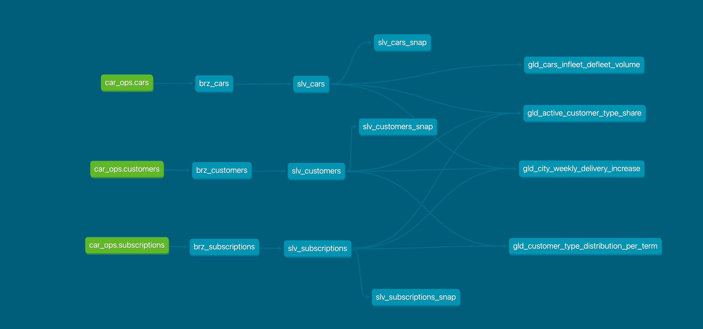

# DriveSight Model Development, Execution & Scheduling Guide

## Overview

**DriveSight** project implements a medallion architecture (Bronze → Silver → Gold) using data modeling principles.



## 🏗️ Medallion Architecture

### Data Flow Architecture
The project implements a three-layer medallion architecture:

```
📊 SOURCES (Raw Data)
    ↓
🥉 BRONZE LAYER (Raw Ingestion)
    ↓
🥈 SILVER LAYER (Cleaned & Standardized)
    ↓
🥇 GOLD LAYER (Business-Ready Analytics)
```

### Layer Responsibilities

#### 🥉 Bronze Layer
- **Purpose**: Raw data ingestion with minimal transformation
- **Materialization**: Incremental (daily refresh)
- **Data Retention**: Historical data storage
- **Models**: `brz_customers`, `brz_cars`, `brz_subscriptions`

#### 🥈 Silver Layer  
- **Purpose**: Data cleaning, standardization, and quality enforcement
- **Materialization**: Table (full refresh based on bronze and SCD tracked using snapshots)
- **Transformations**: Type standardization, data validation, calculated fields
- **Models**: `slv_customers`, `slv_cars`, `slv_subscriptions`

#### 🥇 Gold Layer
- **Purpose**: Business-ready aggregated models for analytics
- **Materialization**: Table/Incremental (optimized for query performance)
- **Focus**: Domain-specific business metrics
- **Domains**: 
  - **Customer Acquisition**: `gld_active_customer_type_share`, `gld_customer_type_distribution_per_term`
  - **Operations**: 
  `gld_cars_infleet_defleet_volume`, `gld_city_weekly_delivery_increase`

# ⚙️ Model Development Strategy

This section outlines how each data layer is developed and managed within the **DriveSight Analytics** using dbt and DuckDB.

---

## 🥉 Bronze Layer - Raw Ingestion

- **Purpose**: Ingests raw data from source systems (e.g., customers, cars, subscriptions).
- **Transformation**: _None_ – preserves raw shape.
- **Change Handling**:
  - Detects and allows schema changes without breaking the pipeline.
  - Automatically **appends new columns** as they appear in the source.
- **Lineage Tracking**:
  - Adds a `load_date` column to track when the data was ingested.
- **Incremental Strategy**: `delete+insert`
  - Deletes records for the current `load_date` and re-inserts updated data.
  - Ensures no duplicate rows are loaded on re-execution for the same day.

---

## 🥈 Silver Layer - Cleaned Models

- **Purpose**: Transforms and standardizes bronze data for analytical use.
- **Schema Enforcement**: 
  - Schema mismatches will **fail the pipeline**, ensuring structural consistency.
- **Lineage Tracking**:
  - Adds both `rep_date` (reporting date) and `load_date` (ingestion date).
- **Snapshots**:
  - Used to track slowly changing dimensions or temporal changes in records.
- **New Metrics**:
  - Business logic and derived fields are defined and documented in [`SCHEMA DOCUMENTATION`](MODEL_SCHEMA.md#silver-layer-schema).

---

## 🥇 Gold Layer - Business Metrics

- **Purpose**: Final models consumed by stakeholders and dashboards.
- **Materialization**:
  - **Incremental**: Used for append-only datasets.
  - **Table**: Used for models that require full recomputation.
- **Schema Enforcement**:
  - Ensures models break if unexpected structural changes occur.
- **Data Overwrites**:
  - Supports `--full-refresh` with `rep_date` for backfilling old logic.
- **Domain-Specific Models**:
  - Models are organized by business domain (e.g., operations, customer acquisition).
- **Change Detection**:
  - Uses `unique_combination_of_columns` to detect updates and overwrite during incremental runs.
- **Backfilling**:
  - Uses `--full-refresh` flag to overwrite data for complete historical dates.
  - Pass `rep_date` variable to specify the date to backfill.
  - Useful for correcting logic errors or data issues.
- **Business metrics**: Defined and documented in [`SCHEMA DOCUMENTATION`](MODEL_SCHEMA.md#gold-layer-schema).

---

## 🧪 Testing Framework

### Testing Strategy Overview
The DriveSight project implements a comprehensive testing framework across all data layers to ensure data quality, business logic correctness, and pipeline reliability.

### Test Categories

#### 1. **Schema-Level Tests**
Defined in `schema.yml` files to enforce data quality constraints:

```yaml
# Example from models/silver/schema.yml
models:
  - name: slv_customers
    tests:
      - at_least_one_row
    columns:
      - name: customer_id
        tests: [unique, not_null]
      - name: customer_type
        tests:
          - accepted_values:
              values: ['b2b', 'b2c', 'other']
```

#### 2. **Custom Test Macros**
Located in `macros/tests/` directory:

- **`at_least_one_row.sql`**: Ensures tables contain data
- **`validate_rep_date.sql`**: Validates rep_date variable parameter

```sql
-- Example custom test macro

SELECT 1
WHERE NOT EXISTS (
    SELECT 1 FROM {{ model }}
)

```

#### 3. **dbt-utils Advanced Tests**
Leveraging the dbt-utils package for sophisticated testing:

```yaml
# Advanced range and expression tests
columns:
  - name: monthly_rate
    tests:
      - dbt_utils.accepted_range:
          min_value: 0
          inclusive: true
      - dbt_utils.expression_is_true:
          expression: "{{ column_name }} >= 0"
```

#### 4. **Business Logic Tests**
Custom SQL tests in `tests/` directory:

- **`assert_car_registration_before_deregistration.sql`**: Validates car lifecycle logic
- **`assert_subscription_dates_logical.sql`**: Ensures subscription date consistency

```sql
-- Example business logic test
-- tests/silver/assert_subscription_dates_logical.sql
SELECT subscription_id
FROM {{ ref('slv_subscriptions') }}
WHERE start_date > end_date
   OR created_at > start_date
```

### Test Execution Commands

#### Run All Tests
```bash
# Execute all tests across the project
dbt test

# Run tests with verbose output
dbt test --verbose
```

#### Selective Test Execution
```bash
# Test specific models
dbt test --select slv_customers
dbt test --select gld_active_customer_type_share

# Test by layer
dbt test --select tag:silver
dbt test --select tag:gold

# Test with dependencies
dbt test --select +gld_customer_type_distribution_per_term
```

#### Test Configuration Options
```bash
# Store test failures for debugging
dbt test --store-failures

# Run tests on specific data
dbt test --vars '{"rep_date": "2024-01-15"}'

# Fail fast on first test failure
dbt test --fail-fast
```

### Debugging

#### Debugging Failed Tests
```bash
# View detailed test results
dbt test --store-failures
# Failed test data stored in: <target_schema>_dbt_test__audit

# Query failed test results
SELECT * FROM main_dbt_test__audit.not_null_slv_customers_customer_id;
```

### Test Coverage by Layer

#### **Silver Layer Tests**
- **Data Quality**: NULL checks, uniqueness, referential integrity
- **Business Rules**: Customer type validation, date logic
- **Transformation Logic**: Calculated field accuracy

#### **Gold Layer Tests**
- **Aggregation Accuracy**: Sum validations, percentage calculations
- **Data Quality**: NULL checks, unique combinations

---

# 🚀 Optimization Strategies

| Layer   | Optimization                                                       |
|---------|--------------------------------------------------------------------|
| Bronze  | Skips unused source tables                                         |
| Silver  | Only pulls required columns, not full rows                         |
| Silver  | Avoids storing historical versions — snapshots used instead        |
| Silver/Gold     | Filters by `rep_date` for efficient incremental processing         |
| Silver/Gold     | Enforces column selection instead of using `SELECT *`             |

---

## ✅ Optimal Practices Example

```sql
-- Use incremental materialization wherever possible and apply different filters for incremental runs
{{ config(materialized='incremental') }}

    WHERE date_column = {{ rep_date }}  -- Incremental: only specific data range

    WHERE date_column <= {{ rep_date }}  -- Full refresh: all historical data


-- Avoid SELECT * 
SELECT specific_columns 

-- Use appropriate data types
CAST(column AS DECIMAL(10,2))  -- Explicit casting
```

## 🔄 Model Execution

### Data Versioning Strategy
- **Bronze Models**: Run daily, store historical data
- **Silver/Gold Models**: Runs daily/weekly and runs on-demand also with `rep_date` parameter for backfill
- **Historical Analysis**: Access any date's version of data using `rep_date` variable
- **Backfill**: Use `--full-refresh` flag to overwrite data for a specific date range by passing the `rep_date` variable
- **NOTE**: `rep_date` has below constraints
  - **Default**: If not provided, `rep_date` defaults to today's date.
  - Must be in format: `YYYY-MM-DD`
  - Must be **today or a past date**
  - Invalid or future values may result in model failure

### Execution Commands

```bash
# Run all models with default date (Today's date)
dbt run

# Run with specific reporting date
dbt run --vars '{"rep_date": "2024-01-15"}'

# Run specific layers
dbt run --select tag:bronze
dbt run --select tag:silver  
dbt run --select tag:gold

# Run by tags to run daily/weekly refresh models
dbt run --select tag:daily_refresh
dbt run --select tag:weekly_refresh

# Run models for specific domain
dbt run --select tag:customer_acquisition

# Run model for backfill with specific date range
dbt run --select tag:gold --vars '{"rep_date": "2024-01-15"}' --full-refresh

# Run specific models
dbt run --select gld_active_customer_type_share

# Run with dependencies
dbt run --select +gld_customer_type_distribution_per_term  # upstream
dbt run --select gld_customer_type_distribution_per_term+  # downstream

# Run + tests + snapshots + seeds for all models
dbt build
```

## 📅 Scheduling & Dependencies

### ⏱ Scheduling Methods

DBT model executions can be scheduled using various tools depending on your environment and team preferences. Below are common scheduling strategies:

#### 1. **dbt Cloud Scheduler**
- Built-in UI for scheduling jobs.
- Supports setting environment variables and tags.
- Can schedule by time or trigger on events.

```text
Example:
- Job Name: Daily Gold Models
- Schedule: Every day at 6:00 AM
- Command: 'dbt run --select tag:daily_refresh'
```

#### 2. Airflow
- Flexible DAG-based orchestration.
- Recommended for complex workflows or cross-system scheduling.
- Use `BashOperator`, `DBTCloudRunJobOperator`, or custom plugins.

```python
# Example: Run dbt daily refresh
BashOperator(
    task_id="run_dbt_daily",
    bash_command="dbt run --select tag:daily_refresh --target prod",
)
```

#### 3. Cron Jobs
- Simple and effective for basic scheduling needs.
- Can be scheduled via OS-level cron (Linux/macOS).

```bash
# Example crontab entry for daily run at 2 AM
0 2 * * * cd /path/to/dbt/project && dbt run --select tag:daily_refresh
```

#### 4. CI/CD Pipelines (e.g., GitHub Actions, GitLab CI)
- Useful for development, test, or lightweight production runs.
- Supports:
  - Scheduled runs using cron syntax
  - Triggers on code events (e.g., push, merge)
  - Easy integration into version-controlled workflows

#### ✅ GitHub Actions Example

```yaml
# .github/workflows/dbt-daily.yml
name: Daily dbt Run

on:
  schedule:
    - cron: '0 6 * * *'  # Runs every day at 6:00 AM UTC
  workflow_dispatch:      # Allows manual trigger

jobs:
  run-dbt:
    runs-on: ubuntu-latest
    steps:
      - name: Checkout repo
        uses: actions/checkout@v3

      - name: Set up Python
        uses: actions/setup-python@v4
        with:
          python-version: '3.11'

      - name: Install dbt
        run: pip install dbt-core dbt-duckdb 

      - name: Run dbt
        run: dbt run --select tag:daily_refresh
```

### 5. Custom Schedulers / Orchestration Platforms

- Tools like Prefect, Dagster, or others can integrate with dbt.
- Useful for more complex scheduling logic or observability.

### Model Scheduling Strategy

#### Daily Refresh Models
```bash
# Models tagged with daily_refresh
dbt run --select tag:daily_refresh # By default runs with today's date
dbt run --select tag:daily_refresh --vars '{"rep_date": "2024-01-15"}'  # For backfill
```

**Daily Models:**
- `brz_*` (Bronze layer models)
- `gld_cars_infleet_defleet_volume` `gld_active_customer_type_share` `gld_customer_type_distribution_per_term`  (Gold layer models)
- Silver layer models (as needed by upstream gold models)

#### Weekly Refresh Models
```bash
# Models tagged with weekly_refresh
dbt run --select tag:weekly_refresh # By default runs with today's date
dbt run --select tag:weekly_refresh --vars '{"rep_date": "2024-01-15"}'  # For backfill, It'll run for the week containing the specified date
```

**Weekly Models:**
- `gld_city_weekly_delivery_increase` (Gold layer model): Calculates the absolute weekly increase, so it is refreshed weekly, not daily
- Silver layer models (as needed)

### Dependency Management

#### Upstream Dependencies
```bash
# Run model with all upstream dependencies
dbt run --select +model_name

# Example: Run customer analysis with all dependencies
dbt run --select +gld_active_customer_type_share
```

#### Downstream Dependencies
```bash
# Run model with all downstream dependencies
dbt run --select model_name+

# Example: Run silver customers with downstream impacts
dbt run --select slv_customers+
```

#### Selective Execution
```bash
# Run specific domain models
dbt run --select models/gold/customer_acquisition

# Run by multiple tags
dbt run --select tag:customer_acquisition,tag:daily_refresh

# Exclude specific models
dbt run --exclude tag:weekly_refresh
```

## 🛠 Troubleshooting

### Common Issues and Solutions

#### 1. Model Run Failures
```bash
# Check for compilation errors
dbt compile

# Run with debug logging
dbt run --select model_name --log-level debug

# Check model dependencies
dbt list --select +model_name
```

#### 2. Data Quality Issues
```bash
# Run data quality tests
dbt test --select silver

# Check for failed tests
dbt test --store-failures

# Query failed test results
SELECT * FROM main_silver_dbt_test__audit.failed_test_results;
```

#### 3. Performance Issues
```sql
-- Check table sizes
SELECT
    COUNT(*) as row_count
FROM main_gold.gld_active_customer_type_share;

-- Analyze query performance
EXPLAIN ANALYZE
SELECT * FROM main_gold.gld_active_customer_type_share
WHERE month >= '2024-01-01';
```

### Environment-Specific Commands
```bash
# Use development profile
dbt run --target dev
```

## 📚 Additional Resources

### Model Documentation
- Access model documentation: `dbt docs serve`
- View lineage graphs for understanding dependencies
- Check model descriptions and column definitions

```
For additional support, refer to the project documentation or contact the data engineering team.
```