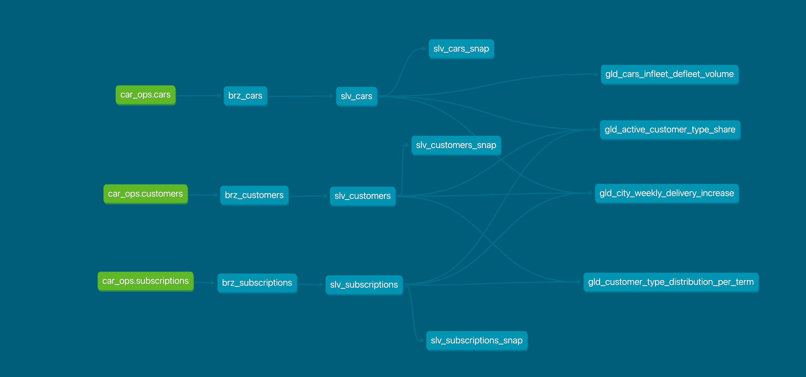

# 🚗 DriveSight Analytics

**A comprehensive analytics solution for FINN's car subscription business**



## 📋 Table of Contents

- [Project Overview](#project-overview)
- [Architecture](#architecture)
- [Documentation](#documentation)
  - [Setup & Configuration Guides](docs/DBT_SETUP_GUIDE.md)
  - [Model Development & Run Guide](docs/MODEL_DEV_AND_RUN_GUIDE.md)
  - [Model Schema Documentation](docs/MODEL_SCHEMA.md)
  - [Querying Guide](docs/MODEL_QUERYING.md)
- [Project Structure](#project-structure)
- [Development Workflow](#development-workflow)
- [Business Use Cases](#business-use-cases)

## Project Overview

**DriveSight** is a modern data analytics solution built with dbt (data build tool) and DuckDB, designed to provide comprehensive insights into FINN's car subscription business. The solution implements a medallion architecture (Bronze → Silver → Gold) to transform raw operational data into business-ready analytics.

### Business Domains
- **Customer Acquisition**: Customer segmentation, type distribution, and acquisition patterns
- **Fleet Operations**: Vehicle lifecycle management, infleet/defleet tracking, and utilization metrics
  

### Key Features
- ✅ **Medallion Architecture**: Bronze (raw) → Silver (cleaned) → Gold (business-ready)
- ✅ **Data Quality**: Comprehensive testing and validation framework
- ✅ **Historical Analysis**: Time-based reporting with configurable date parameters
- ✅ **Scalable Design**: Modular structure supporting multiple business domains

## Architecture

### Data Flow
```
📊 Source Systems (FINN Operations)
    ↓
🥉 Bronze Layer (Raw Data Ingestion)
    ↓
🥈 Silver Layer (Data Cleaning & Standardization)
    ↓
🥇 Gold Layer (Business Analytics)
    ↓
📈 Business Intelligence & Reporting
```

### Technology Stack
- **Data Transformation**: dbt (data build tool)
- **Database**: DuckDB (embedded analytical database)
- **Language**: SQL with Jinja templating
- **Testing**: dbt tests + custom validation notebooks
- **Documentation**: dbt docs + comprehensive markdown guides


## Documentation

### Setup & Configuration Guides
| Document | Description |
|----------|-------------|
| [**DBT Setup Guide**](docs/DBT_SETUP_GUIDE.md) | Complete setup instructions, environment configuration, and project initialization |
| [**Model Development & Run Guide**](docs/MODEL_DEV_AND_RUN_GUIDE.md) | Model development workflow, testing, and execution strategies |

### Data & Schema Documentation
| Document | Description |
|----------|-------------|
| [**Model Schema Documentation**](docs/MODEL_SCHEMA.md) | Comprehensive schema definitions, column descriptions, and data lineage |
| [**Model Querying Guide**](docs/MODEL_QUERYING.md) | Query examples, business use cases, and analytical patterns |

### 🏗️ Architecture & Design

| Resource              | Description                                                 |
|-----------------------|-------------------------------------------------------------|
| [**Data Flow Diagram**](docs/main_dag.png) | Visual representation of the medallion architecture |
| **dbt Docs**          | Auto-generated documentation with lineage graphs. <br>Run using:<br>`dbt docs generate`<br>`dbt docs serve` |


### Interactive Analysis
| Notebook | Description |
|----------|-------------|
| [**Data Analysis Notebook**](notebooks/duckdb_analysis.ipynb) | Exploratory data analysis and validation |
| [**Model Querying Notebook**](notebooks/model_querying.ipynb) | Interactive model testing and business analysis |

## Project Structure

```
drivesight/
├── 📁 .dbt/                     # dbt configuration directory
│   ├── profiles.yml            # Database connection profiles
│   └── .user.yml               # User-specific settings
│
├── 📁 models/                   # dbt models organized by layer
│   ├── 🥉 bronze/              
│   │   ├── brz_customers.sql   # Customer raw data ingestion
│   │   ├── brz_cars.sql        # Vehicle fleet raw data
│   │   └── brz_subscriptions.sql # Subscription raw data
│   │
│   ├── 🥈 silver/              
│   │   ├── slv_customers.sql   # Cleaned customer data with standardized types
│   │   ├── slv_cars.sql        # Processed vehicle data with calculated fields
│   │   ├── slv_subscriptions.sql # Standardized subscription data
│   │   └── schema.yml          # Silver layer tests and documentation
│   │
│   ├── 🥇 gold/                
│   │   ├── customer_acquisition/
│   │   │   ├── gld_active_customer_type_share.sql      # B2B/B2C share by brand/month
│   │   │   └── gld_customer_type_distribution_per_term.sql # Customer segmentation by terms
│   │   ├── operations/
│   │   │   ├── gld_cars_infleet_defleet_volume.sql     # Daily fleet volume tracking
│   │   │   └── gld_city_weekly_delivery_increase.sql   # Weekly city delivery growth
│   │   └── schema.yml          # Gold layer tests and documentation
│   │
│   └── sources/               
│       └── drivesight/
│           └── sources.yml     # Source system table definitions
│
├── 📁 macros/                  # Reusable SQL macros and functions
│   ├── silver/                 # Data transformation macros
│   │   └── get_term_month_numeric.sql # Convert text terms to numeric months
│   └── tests/                  # Custom test macros
│       ├── table_generic/
│       │   └── at_least_one_row.sql    # Ensure tables have data
│       └── utils/
│           └── validate_rep_date.sql   # Date parameter validation
│
├── 📁 tests/                   # Custom data quality tests
│   └── silver/                 # Silver layer specific tests
│       ├── assert_car_registration_before_deregistration.sql
│       └── assert_subscription_dates_logical.sql
│
├── 📁 snapshots/               # SCD Type 2 historical snapshots
│   └── silver/                 # Silver layer snapshots
│       ├── slv_cars_snap.sql   # Historical car data changes
│       ├── slv_customers_snap.sql # Historical customer changes
│       └── slv_subscriptions_snap.sql # Historical subscription changes
│
├── 📁 docs/                    # Project documentation
│   ├── DBT_SETUP_GUIDE.md      # Complete setup and configuration guide
│   ├── MODEL_DEV_AND_RUN_GUIDE.md # Development workflow guide
│   ├── MODEL_QUERYING.md       # Query examples and business use cases
│   ├── MODEL_SCHEMA.md         # Schema definitions and data lineage
│   └── main_dag.png            # Data architecture diagram
│
├── 📁 notebooks/               # Jupyter notebooks for analysis
│   ├── duckdb_analysis.ipynb   # Data exploration and validation
│   └── model_querying.ipynb    # Interactive business analysis
│
├── 📁 analyses/                # Ad-hoc analytical queries (not materialized)
│
├── 📁 seeds/                   # CSV files for reference data (empty)
│
├── 📁 logs/                    # dbt execution logs
│
├── 📁 target/                  # dbt compilation and run artifacts
│   ├── compiled/               # Compiled SQL files
│   ├── run/                    # Executed SQL files
│   ├── manifest.json           # Project metadata
│   ├── catalog.json            # Data catalog information
│   └── run_results.json        # Execution results
│
├── 📁 dbt_packages/            # Installed dbt packages
│   └── dbt_utils/              # dbt utility functions and macros
│
├── dbt_project.yml             # dbt project configuration
├── packages.yml                # dbt package dependencies
└── README.md                   
```

## Development Workflow

### Model Development Process
1. **Design**: Define business requirements and data model structure
2. **Develop**: Create SQL models following naming conventions
3. **Test**: Add data quality tests and validation rules
4. **Document**: Update schema.yml with column descriptions
5. **Validate**: Run models and tests locally
6. **Deploy**: Commit changes and deploy to production

### Naming Conventions
- **Bronze Models**: `brz_<source_table_name>`
- **Silver Models**: `slv_<business_entity>`
- **Gold Models**: `gld_<metric_description>`
- **Tests**: Descriptive names explaining the validation logic

### Tagging Strategy
- **Layer Tags**: `bronze`, `silver`, `gold`
- **Refresh Tags**: `daily_refresh`, `weekly_refresh`
- **Domain Tags**: `customer_acquisition`, `operations`
- **Model-Specific Tags**: Individual model identifiers for selective runs


## Business Use Cases

### Customer Acquisition Analytics
- **Customer Segmentation**: Analyze B2B vs B2C customer distribution
- **Acquisition Trends**: Track customer growth by brand and time period
- **Term Analysis**: Understand subscription term preferences by customer type

### Fleet Operations Analytics
- **Fleet Utilization**: Monitor active vs inactive vehicle ratios
- **Performance Metrics**: Analyze fleet size over time

### Delivery Operations Analytics
- **City Performance**: Compare delivery performance across cities
- **Growth Analysis**: Track weekly delivery growth rates
- **Operational Insights**: Identify high-performing and underperforming markets

This documentation provides a comprehensive guide to the **DriveSight Analytics**. For detailed information on each aspect, please refer to the respective documentation files within the `docs/` directory.